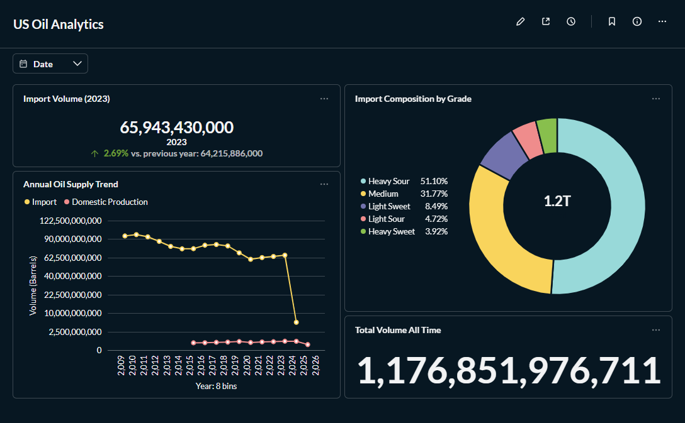

# US Oil Supply Chain Analytics 🛢️

Dự án Data Engineering xây dựng kho dữ liệu (Data Warehouse) để phân tích mức độ phụ thuộc năng lượng của Mỹ vào nhập khẩu so với sản xuất nội địa.

## 📊 Dashboard Result

*(Ảnh chụp kết quả phân tích trên Metabase)*

## 🛠️ Tech Stack
- **Infrastructure:** Docker, Docker Compose
- **Database:** MySQL 8.0
- **ETL:** Python (Pandas, SQLAlchemy)
- **Transformation:** dbt Core (Data Build Tool)
- **Visualization:** Metabase

## 🚀 How to run
1. Clone repo này về máy.
2. Chạy `docker-compose up -d` để dựng Database & BI.
3. Chạy `python scripts/etl_imports.py` để nạp dữ liệu.
4. Chạy `dbt build` để làm sạch và tổng hợp dữ liệu.
5. Mở `localhost:3000` để xem báo cáo.